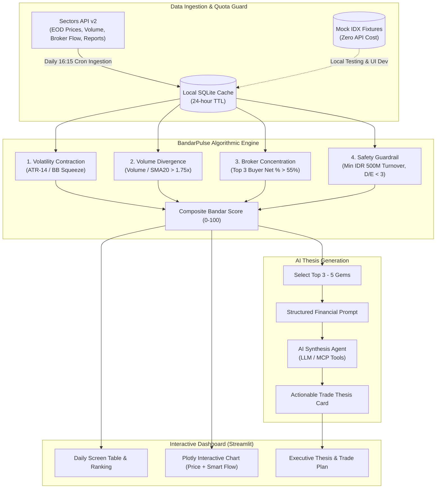

# Business Requirements Document (BRD)
## Project Name: **BandarPulse – Autonomous Market Intelligence & Early Accumulation Detector**
**Event:** Sectors Hackathon 2026  
**Track:** Track 3 – Market Intelligence  
**Theme:** *"Hidden gems & early accumulation by bandar"*  
**Author / Team:** Apriyanto  
**Version:** 1.0  
**Date:** September 20, 2026  

---

## 1. Executive Summary & Problem Statement

### 1.1 The Problem
In the Indonesia Stock Exchange (IDX), retail investors consistently enter winning trades too late (FOMO stage) after prices have already spiked by 20%–50%. The underlying reason is information asymmetry:
1. **Stealth Accumulation**: Institutional investors, fund managers, and domestic "bandar" (smart money) routinely accumulate shares during quiet, low-volatility consolidation phases (sideways boxes).
2. **Data Complexity**: Analyzing broker transaction flow (Broker Summary / Foreign Flow) requires parsing dense tables across hundreds of tickers, which is cognitive overload for retail traders.
3. **The Junk-Stock Trap**: Simple volume screeners often lure investors into insolvent penny stocks ("saham gorengan busuk") that lack fundamental assets and liquidity, leading to catastrophic capital lockups.

### 1.2 The Solution
**BandarPulse** is an autonomous market intelligence agent designed to democratize institutional-grade smart-money detection for retail equity traders. It scans IDX stocks daily, calculates a quantitative **BandarPulse Accumulation Score (0–100)** using mathematical volatility squeeze and broker concentration formulas, filters out non-viable companies using fundamental health guardrails, and leverages LLM reasoning to synthesize institutional flow data into concise, actionable trading theses.

---

## 2. Product Objectives & Target Personas

### 2.1 Key Objectives
- **Early Detection**: Identify high-conviction accumulation 3–10 trading days *prior* to technical breakout.
- **Capital Safety**: Enforce minimum liquidity and solvency thresholds to eliminate pump-and-dump traps.
- **Actionable Clarity**: Translate complex microstructure flow data into 3 concise items: Accumulation Zone, Invalidation (Cut Loss), and Risk/Reward Targets.
- **Credit Efficiency**: Employ a local cache-first architecture to maximize the value of the 1,600 total Sectors API credits.

### 2.2 Target User Persona
- **Persona**: *The Part-Time IDX Swing Trader / Investor*
- **Pain Point**: Works full-time during trading hours (09:00–16:00 WIB), cannot watch the order book tick-by-tick, and needs a reliable post-market (16:15 WIB) briefing highlighting the 3–5 highest quality hidden gems with verifiable institutional footprint.

---

## 3. System Architecture & Flow

---

## 4. Functional Specifications (Core Modules)

### Module 1: Ingestion & Caching Layer (API Quota Guard)
- **FR-1.1**: Connect to Sectors API v2 endpoints (`https://api.sectors.app/v2/`) with Bearer token authentication.
- **FR-1.2**: Persistent SQLite Cache (`bandarpulse.db`) storing raw payloads for:
  - Company profiles & fundamental metrics (`/company/report/{ticker}/`)
  - Historical EOD OHLCV (`/companies/`)
  - Broker activity & flow records (`/broker-activity/`)
- **FR-1.3**: Zero-Credit Mock Engine toggle (`USE_MOCK=True`) enabling endless UI iteration, unit testing, and video rehearsal without debiting live API balance.

### Module 2: Quantitative Bandarmologi Engine
The engine computes four deterministic signals for each screened stock:

1. **Volatility Contraction Index (VCI)**:
   - Evaluates price range consolidation over a 10-day rolling window against 50-day average True Range.
   - High score when price is trading in a tight sideways band ($\text{ATR}_{10} / \text{ATR}_{50} \le 0.70$).
2. **Volume Anomaly Ratio (VAR)**:
   - Flags stealth volume surges:
     $$\text{VAR} = \frac{\text{Volume}_{\text{today}}}{\text{SMA}_{20}(\text{Volume})}$$
   - High score when $\text{VAR} \ge 1.75$ without corresponding explosive price surge (indicating silent absorption).
3. **Broker Concentration Index (BCI)**:
   - Measures institutional dominance:
     $$\text{BCI}_{\text{Top3}} = \frac{\sum_{i=1}^3 \text{Net Buyer Value}_i}{\text{Total Traded Value}} \times 100\%$$
   - Flags high accumulation when $\text{BCI}_{\text{Top3}} \ge 55\%$.
4. **Fundamental & Liquidity Guardrail**:
   - Average daily turnover $\ge$ IDR 500,000,000 (eliminates illiquid penny stock traps).
   - Debt to Equity (D/E) $< 3.0$ and Operating Cash Flow $> 0$ (filters out insolvent companies).
   - Exclude stocks listed on IDX Special Monitoring Board (*Papan Pemantauan Khusus*).

**Composite Bandar Score**:
$$\text{Score} = (0.35 \times \text{BCI}) + (0.25 \times \text{VAR}) + (0.20 \times \text{VCI}) + (0.20 \times \text{Safety Score})$$

### Module 3: Agentic AI Thesis Engine
- **FR-3.1**: Ingests quantified outputs from Module 2 and constructs structured JSON payloads.
- **FR-3.2**: Generates a 3-part structured institutional brief:
  - **The Accumulation Story**: Who is buying (e.g. Foreign / top institutional brokers) and who is selling (e.g. retail panic exit).
  - **Fundamental Catalyst**: Brief justification of why smart money is taking an interest (e.g. sector tailwind, undervalued earnings).
  - **Actionable Trade Plan**:
    - Recommended Accumulation Zone: $[P_{\text{low}}, P_{\text{high}}]$
    - Invalidation / Hard Stop: $P_{\text{stop}}$ (-3% to -5% below box support)
    - Target Breakout Level: $P_{\text{target}}$ (minimum 1:2.5 Risk-to-Reward ratio)

### Module 4: Presentation & UI (Streamlit)
- **FR-4.1 (Leaderboard)**: Sorted screener ranking with badges ("Strong Accumulation", "High Conviction Gem", "Moderate").
- **FR-4.2 (Interactive Charts)**: Plotly Candlestick chart overlaid with Accumulation/Distribution (A/D) line and Top Broker Net Flow bars.
- **FR-4.3 (AI Intelligence Panel)**: Clean collapsible card rendering the AI-generated thesis with copyable summary for trader logs.

---

## 5. Non-Functional & Hackathon Alignment

### 5.1 Quota Optimization Budget
| Source | Credits Available | Usage Strategy |
| :--- | :--- | :--- |
| Referral Bonus | 100 credits | Initial testing & schema discovery |
| Onboarding Quest | 500 credits | Feature engineering & validation |
| Team Hackathon Grant | 1,000 credits | Full batch run & live judging demo recording |
| **Total** | **1,600 credits** | **100% sufficient with SQLite cache architecture** |

### 5.2 Deliverables Checklist (Submission Requirements)
- [x] **Public GitHub Repository**: Clean codebase, modular structure, `.env.example`, and comprehensive `README.md`.
- [ ] **Teaser Video (1 Minute)**: Fast-paced overview highlighting the retail pain point and BandarPulse live detection.
- [ ] **Judging Video (3 Minutes)**:
  - 0:00 - 0:45: Problem Statement & Why existing retail screeners fail.
  - 0:45 - 2:00: Live Product Demo (Streamlit + Plotly + AI Thesis).
  - 2:00 - 2:45: Architecture, Sectors API integration, and Quant Formula.
  - 2:45 - 3:00: Future vision & MCP agent deployment.
- [ ] **Problem Statement**: Standardized 1-sentence statement.
- [ ] **Official Canva Cover**: Using template shared on Slack `#announcement`.

---

## 6. Development Milestones & Roadmap

| Phase | Duration | Scope |
| :--- | :--- | :--- |
| **Phase 1: Design & BRD** | Day 1 | Lock BRD, mathematical formulas, and project scaffolding in Antigravity |
| **Phase 2: Ingestion & Mock Engine** | Day 1–2 | Build Sectors client, SQLite cache, and mock fixtures |
| **Phase 3: Quant Formula Calibration** | Day 2–3 | Implement VCI, VAR, BCI, and composite scoring |
| **Phase 4: Streamlit UI & Visuals** | Day 3–4 | Polish interactive dashboard, charts, and AI Thesis card |
| **Phase 5: VPS Deployment** | Day 4 | Deploy to VPS with public URL (Cloudflare Tunnel) |
| **Phase 6: Pitch Media & Submission** | Day 5 | Record 1-min teaser, 3-min demo, and publish submission |
